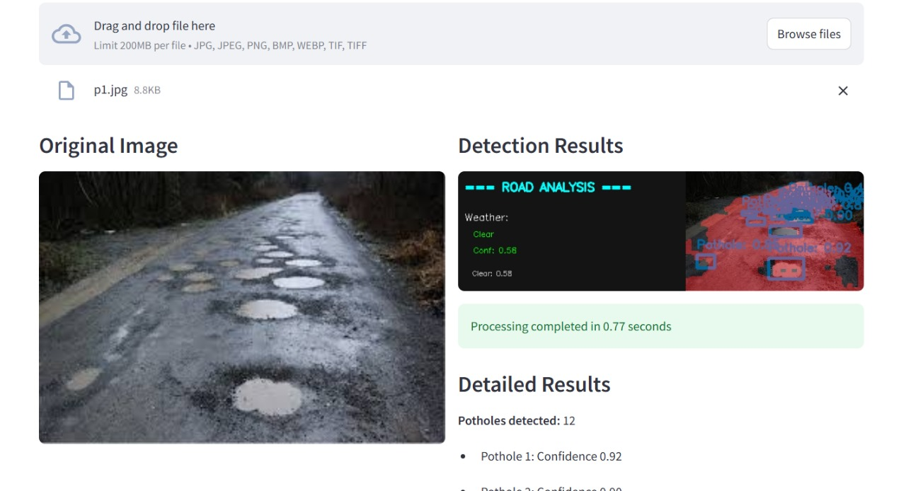

# Vision X – Smart Multi-Scenario Road Analyzer🛣️

A comprehensive real-time road analysis system that performs simultaneous detection of potholes, traffic signs, lane lines, and weather conditions using advanced computer vision models.

## Project Overview

Vision X is an integrated road analysis system that combines multiple deep learning models to provide comprehensive road condition analysis:

- **Pothole Detection**: Identifies road damage and potholes using YOLOv5
- **Traffic Sign Detection**: Detects and classifies traffic signs using YOLOv5
- **Lane Detection**: Identifies road lanes and drivable areas using ENet-SAD
- **Weather Prediction**: Classifies weather conditions using EfficientNet-B1

## Features

- 🖼️ **Image Upload**: Upload and analyze road images with detailed detection results
- 🎥 **Video Processing**: Process video files frame by frame with real-time analysis
- 📹 **Live Camera**: Real-time camera feed with live detection results
- ⚡ **Speed Optimized**: Fast processing with optional performance modes
- 🎨 **Color-Coded**: Easy-to-identify color-coded detections (blue bounding box for potholes, Green for signs, red for lanes)

### 🖼️ Sample Output Preview

Below is an example of detection results generated by Vision X:



> Example shows detection of potholes, weather classification, and processing time per frame.

## How to Run

### Prerequisites
Install the required Python packages:

```bash
pip install streamlit torch torchvision opencv-python pillow numpy ultralytics
```

### Running the Application

1. Navigate to the Models directory:
```bash
cd Models
```

2. Launch the Streamlit application:
```bash
streamlit run unified_detection_app.py
```

3. The app will automatically open in your browser at: `http://localhost:8501`

### Quick Test

To verify all models are working correctly:

```bash
cd Models
python quick_test.py
```

## How to Test

Run the comprehensive test suite to verify all detection models:

```bash
cd Models
python test_models.py
```

This will test:
- ✅ Loading all 4 models (pothole, sign, lane, weather)
- ✅ Model inference capabilities
- ✅ Unified detection system integration

## Project Structure

```
Vision X/
├── Models/
│   ├── unified_detection_app.py   # Main Streamlit application
│   ├── test_models.py              # Comprehensive model tests
│   ├── quick_test.py               # Quick validation
│   ├── enet_sad.py                 # Lane detection architecture
│   ├── pothole_detection.pt        # Pothole detection model
│   ├── sign_detection.pt           # Sign detection model
│   ├── lane_detection_eNet.pth    # Lane detection model
│   ├── weather_prediction.pt      # Weather prediction model
│   └── yolov5/                     # YOLOv5 directory
└── README.md                       # This file
```

## Model Information

| Model | Architecture | Input Size | Detection Type |
|-------|-------------|------------|----------------|
| Pothole Detection | YOLOv5 | 416x416 | Object Detection |
| Sign Detection | YOLOv5 | 416x416 | Object Detection |
| Lane Detection | ENet-SAD | 512x256 | Semantic Segmentation |
| Weather Prediction | EfficientNet-B1 | 112x112 | Classification |

## 🚀 Vision X Module-Wise Performance Metrics

| Module                  | Model Used              | Accuracy     | Precision | Recall   | mAP (if applicable)                     |
| ----------------------- | ----------------------- | ------------ | --------- | -------- | --------------------------------------- |
| **Weather Detection**   | EfficientNet-B1         | **94.2 %**   | 93.8 %    | 92.4 %   | —                                       |
| **Pothole Detection**   | YOLOv5                  | **74.0 %**   | 80.4 %    | 68.6 %   | mAP@0.5 = 75.7 %, mAP@0.5:0.95 = 44.6 % |
| **Road Sign Detection** | YOLOv5                  | **93.1 %**   | 93.8 %    | 92.4 %   | mAP@0.5 = 76.4 %, mAP@0.5:0.95 = 45.1 % |
| **Lane Detection**      | ENet-SAD + OpenCV       | **88.4 %**   | 89.6 %    | 87.2 %   | —                                       |
| **Overall System**      | Integrated Multi-Module | **≈ 87.4 %** | ≈ 89.4 %  | ≈ 85.2 % | —                                       |


## Requirements

- Python 3.8+
- PyTorch
- CUDA (optional, for GPU acceleration)
- All model files must be present in the Models directory

## Usage Examples

### Image Analysis

1. Launch the app
2. Go to "Image Upload" tab
3. Upload a road image
4. View detection results with color-coded annotations

### Video Processing

1. Go to "Video Processing" tab
2. Upload a video file
3. Configure processing options
4. Click "Process Video"
5. Download the processed video

### Live Camera

1. Go to "Real-time Camera" tab
2. Select camera source
3. Configure detection settings
4. Click "Start Camera"
5. View live detection results

## Troubleshooting

### Models Not Loading

- Ensure all `.pt` and `.pth` files are in the Models directory
- Check console for detailed error messages
- Run `python quick_test.py` to diagnose issues

### Performance Issues

- Enable "Fast Mode" in video processing settings
- Adjust "Process Every N Frames" for better performance
- Use GPU acceleration if available

### Camera Access

- Check camera permissions in system settings
- Try different camera indices (Camera 0, 1, 2)
- Close other applications using the camera

## License

This project uses YOLOv5 (under the GPL license) and other open-source computer vision libraries.

## Acknowledgments

- YOLOv5 for object detection capabilities
- ENet-SAD architecture for lane detection
- EfficientNet for weather classification

### 👨‍💻 Developed By  
**Darshit Kachhadiya** 
> *"Turning vision into intelligence — one frame at a time."*

